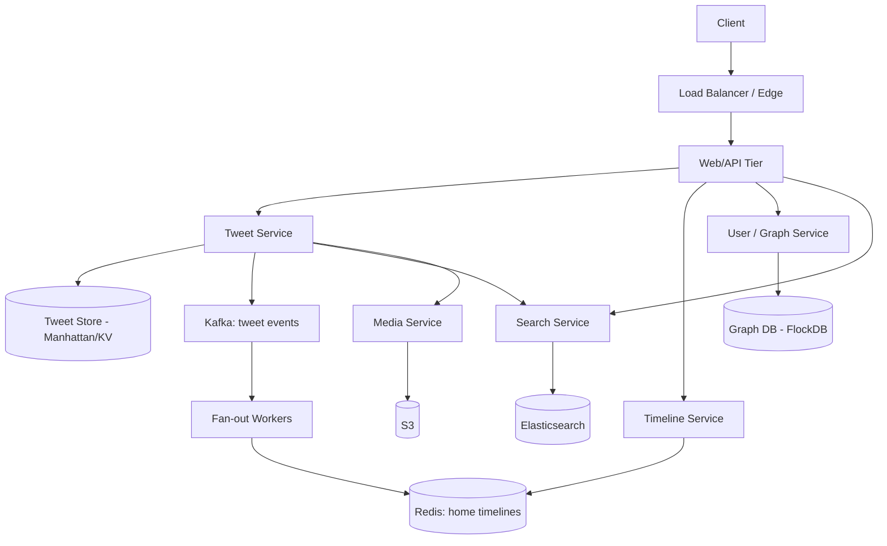
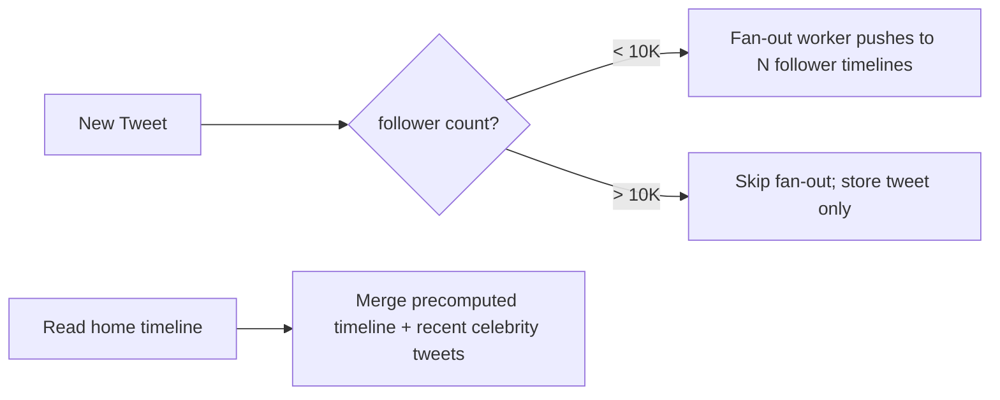
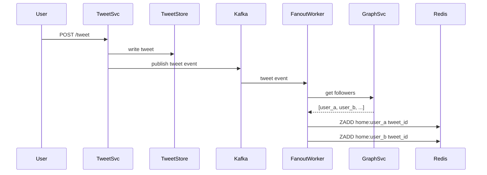

# Design Twitter/X

> **TL;DR** — Twitter at scale is a **feed problem**, not a tweet problem. The hard question is: when Justin Bieber tweets, how do you fan it out to 100 million followers? The two canonical strategies are **fan-out on write** (push to each follower's timeline at tweet time) and **fan-out on read** (gather from people you follow at read time). Real Twitter uses a **hybrid**: fan-out on write for normal users, fan-out on read for celebrities. Reads dominate writes by ~1000:1, timelines are pre-computed and cached, and the social graph lives in its own service.

---

## 1. Requirements

### Functional
- Post a tweet (text up to 280 chars, optional media).
- Follow / unfollow other users.
- View **home timeline** (tweets from people you follow).
- View **user timeline** (someone's own tweets).
- Like, retweet, reply.
- Search.

### Non-Functional
- Latency: home timeline p99 < 200 ms.
- Availability: 99.99%.
- Scale: ~500 M monthly active, ~500 M tweets/day, ~150 K tweets/sec peak, reads/writes ~1000:1.

---

## 2. Back-of-the-Envelope

- 500 M tweets/day → ~6 K tweets/sec average, ~150 K peak.
- Average follower count ~200. **Top 1% have millions of followers.**
- Daily fan-out writes (average): 6 K × 200 = **1.2 M writes/sec** if naive fan-out on write.
- Storage: tweet text ~300 bytes; 500 M × 365 × 10 years = ~550 TB just text.
- Media (images/video) is much larger and stored separately.

---

## 3. High-Level Architecture



The Tweet Service owns writes. Fan-out workers replicate each tweet into the home timelines of followers. The Timeline Service reads from Redis caches — never from the underlying tweet store directly.

---

## 4. The Tweet Store

Each tweet has:
```
tweet_id        Snowflake 64-bit (time-sortable)
user_id         author
content         text
media_ids       []
created_at
reply_to        nullable
retweet_of      nullable
```

Twitter built **Manhattan** in-house — a multi-tenant KV store. You can substitute Cassandra, DynamoDB, or HBase. Pure KV access: lookup by `tweet_id`, secondary index by `user_id`.

Tweet IDs are **Snowflake** (timestamp + machine + sequence). This is the canonical use case — IDs sort by creation time, enabling efficient timeline pagination by cursor. See [Distributed ID Generator →](./id-generator.md).

---

## 5. The Social Graph

A user has followers and follows. ~200 average, ~150 M for the largest accounts.

- **Edges**: `(follower_id, followee_id, created_at)`.
- **Storage**: Twitter uses **FlockDB** (custom graph service over MySQL). Could also be Cassandra with reverse indexes or a true graph DB.
- **Access patterns**:
  - Get followers of user X (for fan-out).
  - Get followees of user X (for fan-out-on-read).
  - "Is A following B?" (for follow button).

Cache aggressively — the graph is mostly read-only at runtime.

---

## 6. Timeline: The Core Problem

Two strategies. The trade-off defines the system.

### 6.1 Fan-out on Write (push)

When user posts, copy the tweet ID into each follower's home timeline list.

```
User A tweets → for each follower of A: push tweet_id to follower's home timeline
```

**Read** is cheap: `LRANGE home:user_X 0 50`. O(1) ish.
**Write** is expensive: O(followers). Justin Bieber tweet = 100 M list inserts.

### 6.2 Fan-out on Read (pull)

Store only the tweet. At read time, for the viewing user, gather tweets from all people they follow.

**Write** is cheap.
**Read** is expensive: O(followees × tweets per followee), then sort/merge.

### 6.3 Hybrid (what Twitter actually does)

- **Normal users** (< 10 K followers): fan-out on write. Push to follower timelines.
- **Celebrities** (> 10 K followers): fan-out on read. Their tweets are not pushed; instead, the timeline service **merges** at read time:
  ```
  home_timeline(user) =
      merge(
          precomputed_timeline_redis(user),     ← from normal-user fan-out
          recent_tweets_from(celebrities_user_follows)
      )
  ```

This is **the** canonical hybrid pattern in social-feed system design.



---

## 7. Home Timeline Storage

Per-user list of the last ~800 tweet IDs in Redis:

```
KEY:    home:user_42
VALUE:  ZSET of tweet_ids scored by Snowflake timestamp
LIMIT:  ~800 entries
```

Why ZSET? Sorting by Snowflake ID gives chronological order; new tweets pushed via `ZADD`, old ones trimmed via `ZREMRANGEBYRANK`.

Materialized timelines per user × 500 M users × 800 IDs × 8 bytes ≈ **3.2 TB** in Redis. Distributed across many Redis nodes. Inactive users are evicted; pull-on-demand for them.

---

## 8. The Fan-out Worker



Workers run in parallel; partition by follower ID. Backpressure is real — when MrBeast tweets, you create a 100 M-item job. Spread across many workers, rate-limit per Redis shard, prioritize active followers.

---

## 9. Media

Photos and videos go through a separate Media Service:
- Upload to S3.
- Pre-generate thumbnail + sized variants.
- Stored as `media_id` reference on the tweet.
- Delivered via CDN (CloudFront / Akamai / Fastly).

Video is harder — see [YouTube/Netflix →](./youtube-netflix.md) for the streaming pipeline.

---

## 10. Search

Indexing every tweet in real-time:
- Tweet events → Kafka → indexer → Elasticsearch.
- Sharded by tweet creation time (recent tweets queried most).
- ~1-second indexing delay typical.

Search ranking blends recency, engagement, and the user's social graph (tweets from people you follow rank higher).

---

## 11. Likes, Retweets, Replies

- **Likes**: counter per tweet + edge `(user, tweet)`. Hot counters need [distributed counter →](./distributed-counter.md) techniques.
- **Retweets**: a new tweet pointing at the original. Fan-out applies normally.
- **Replies**: thread structure stored as `reply_to`. Building the conversation tree on read.

---

## 12. Common Mistakes

- **Naive fan-out on write for everyone** — falls over on celebrities. Hybrid is non-negotiable.
- **Reading the tweet store directly for timelines** — too slow at scale. Always serve from cache.
- **Treating likes as a transaction on the tweet row** — hot row contention. Use counter services.
- **No backpressure on fan-out** — a viral tweet stalls the whole worker pool. Rate-limit per-job.
- **Synchronous indexing into Elasticsearch** — kills write latency. Always async via Kafka.

---

## 13. Cheat Card

```
PURPOSE    Real-time social feed at planet scale.

CORE       Hybrid fan-out: push for normal users, pull for celebrities
           Snowflake IDs sort by time naturally
           Home timelines are precomputed lists in Redis (~800 IDs/user)
           Tweet store: KV (Manhattan / Cassandra / DynamoDB)
           Social graph: edge service with heavy caching

NUMBERS    150 K tweets/sec peak, reads/writes ~1000:1
           Average user: 200 followers; top: 100 M+

PITFALLS   pure fan-out-on-write, sync indexing, hot counter rows,
           reading raw tweet store for timelines, no backpressure.

RULE       Pre-compute timelines for normal users.
           Merge celebrities in at read time.
```

---

## Resources

### Articles
- "The Infrastructure Behind Twitter" — Twitter Engineering blog
- "Manhattan, our real-time, multi-tenant distributed database" — Twitter
- Raffi Krikorian's talks on Twitter's timeline architecture (QCon)

### Videos
- ByteByteGo: "Design Twitter"
- "Building Twitter at scale" — Raffi Krikorian

### Books
- *System Design Interview Vol. 1* — Alex Xu, ch. 9
- *Designing Data-Intensive Applications* — Martin Kleppmann (ch. 1 opens with this exact problem)

### Tools
- Kafka, Redis, Elasticsearch, Cassandra, S3, FlockDB (Twitter OSS)

### Adjacent reading
- [News Feed →](./news-feed.md)
- [Distributed ID Generator →](./id-generator.md)
- [Distributed Counter →](./distributed-counter.md)
- [Fan-out in messaging →](../07-messaging/event-driven-architecture.md)

---

*Previous:* [← Pastebin](./pastebin.md)  |  *Next:* [Instagram →](./instagram.md)
