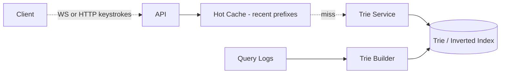

# Design Typeahead / Autocomplete

> **TL;DR** — Typeahead is a **prefix-matching service** that must respond in under 100 ms while the user is typing. The core data structure is a **Trie** (or a compact variant) with each node annotated by the **top-K completions** for that prefix — so lookup is O(prefix length), not a search of the dictionary every keystroke. Variants: add fuzzy matching (one-character typos), personalization (your queries weighted higher), and freshness (trending queries). Google's autocomplete is the gold standard; Elasticsearch's `completion suggester` is the off-the-shelf answer.

---

## 1. Requirements

### Functional
- Return top-N suggestions for any prefix.
- Sub-100 ms latency.
- Ranking by popularity, possibly personalized.
- Fuzzy matching for typos.
- Auto-update as new queries become popular.

### Non-Functional
- Latency p99 < 100 ms (preferably < 50 ms).
- Throughput: matches search QPS (Google: ~100K queries/sec).
- Freshness: trending queries surface within minutes.

---

## 2. Back-of-the-Envelope

- 100 K typeahead requests/sec across a service.
- Suggestions per prefix: top-5 to top-10.
- Source data: history of queries; could be billions of entries.
- Trie size: with proper pruning, ~100 MB to a few GB per language.

---

## 3. High-Level Architecture



---

## 4. The Trie

A trie (prefix tree) stores strings sharing prefixes in a tree.

```
            (root)
         /    |    \
        c     g     m
       /      |      \
      a       o       a
     /        |        \
    t         o         p
   /          |
  s           g
              |
              l
              |
              e
```

Each node represents a prefix. Inserting a word walks/creates the path. Lookup of a prefix returns the subtree.

Annotated trie: at each node, store the **top-K most popular completions** for the prefix at that node.

```
node "go" -> [(google, 1.2B), (gopro, 100M), (good morning, 50M), ...]
```

Lookup of "go" returns the node's pre-computed top-K. O(prefix length).

---

## 5. Building the Trie

Offline batch job:
1. Read query log (e.g., last 30 days).
2. Aggregate query counts.
3. Build trie from queries with count > threshold.
4. Annotate each node with its descendants' top-K.

Pruning is key: don't store ultra-rare queries. The long tail crushes memory.

Rebuilt periodically (e.g., daily). For freshness, layer a real-time recent-query trie on top.

---

## 6. Serving

Two-tier:
- **Hot cache** (Redis): top prefixes → top suggestions. Handles ~99% of traffic.
- **Trie service**: in-memory trie sharded by prefix (e.g., A-D on one shard, E-H on another).

Each shard holds part of the trie. Client routes by first character.

---

## 7. Real-Time Updates

Daily batch is fine for popularity. For trending (a new event causes spikes in queries):
- Stream query counts in real time.
- Background process updates a small "trending" trie or boost scores.
- Merge trending into base suggestions at query time.

---

## 8. Personalization

- Per-user trie (or weights) — too expensive at scale.
- Realistic: re-rank global top-K with user-specific signals (their query history, click history, location).
- ML model on top to re-order the candidate set.

---

## 9. Fuzzy Matching

User types "googel" → should still suggest "google."

Approaches:
- **Edit-distance n-gram index**: index queries by n-gram fingerprints; query the index with n-grams of the typo. Filter by edit distance.
- **Bk-tree**: tree structure for nearest-neighbor in metric space (edit distance).
- **Elasticsearch fuzzy queries**.

Useful but expensive. Often applied only on second-keystroke or when no exact-prefix match.

---

## 10. Multi-Word Prefixes

User types "new york pi" — expect "new york pizza." Suggests:
- Don't just trie by full query; also index by word boundaries.
- Per-word inverted index + composition.
- Or, trie keyed by full query but with intelligent ranking.

Google handles this with sophisticated query understanding.

---

## 11. Storage Options

For static catalogs (product names, place names):
- **In-memory trie** in your own service.
- **Elasticsearch completion suggester** — FST-based, fast.
- **Redis sorted sets** with prefix keys — works for top-K per prefix.

For dynamic query suggestions:
- Custom service with periodic batch updates from logs.

---

## 12. Multi-Language

- Build per-language tries.
- Detect user's language from locale / browser settings.
- Switch tries on request.

Some queries cross languages — composite handling required.

---

## 13. Common Mistakes

- **Searching the full DB for each keystroke** — falls over instantly. Prefix index required.
- **Real-time updates to one global trie** — locking nightmare. Batch + delta.
- **No per-prefix pre-computation** — running top-K per query at request time is slow.
- **No cache** — same prefixes typed millions of times. Hot cache is essential.
- **Ignoring keystroke debouncing on client** — every keystroke hits server; debounce 50–100 ms.

---

## 14. Cheat Card

```
PURPOSE    Sub-100 ms prefix-matched suggestions while typing.

CORE       Trie with each node annotated by top-K completions
           Built offline from query logs; rebuilt daily
           In-memory sharded by first character
           Hot cache (Redis) in front; ~99% hit rate
           Real-time trending boosts merged at query time

LATENCY    p99 < 50–100 ms
SIZE       100 MB – few GB per language with pruning

PITFALLS   no prefix index, no cache, no client debounce,
           single global trie under live updates.

RULE       Pre-compute the top-K per prefix at build time.
           At read time, just walk the trie.
```

---

## Resources

### Articles
- "Building a Trie at scale" — Algolia engineering
- "Elasticsearch Completion Suggester" — Elastic blog
- "Google Search Autocomplete" — Google Search Help

### Documentation
- **Elasticsearch suggesters** — <https://www.elastic.co/guide/en/elasticsearch/reference/current/search-suggesters.html>
- **Lucene FST** — Finite State Transducer used for suggestions

### Tools
- Apache Lucene FST
- Algolia, Typesense

### Videos
- ByteByteGo: "Design Search Autocomplete"

### Adjacent reading
- [Search Autocomplete →](./search-autocomplete.md)
- [Trie Data Structure →](../19-advanced/trie.md)
- [Search Engines →](../04-databases/search-engines.md)
- [Inverted Indexes →](../19-advanced/inverted-index.md)

---

*Previous:* [← Web Crawler](./web-crawler.md)  |  *Next:* [Key-Value Store →](./key-value-store.md)
