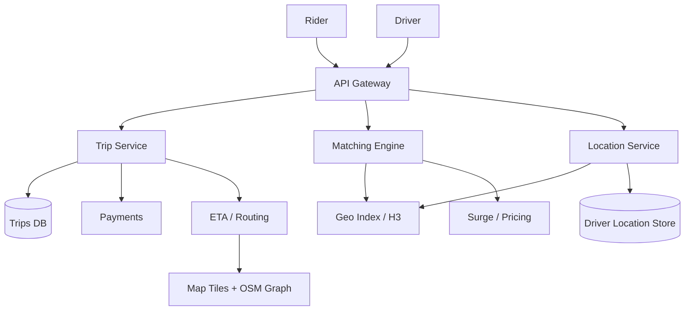
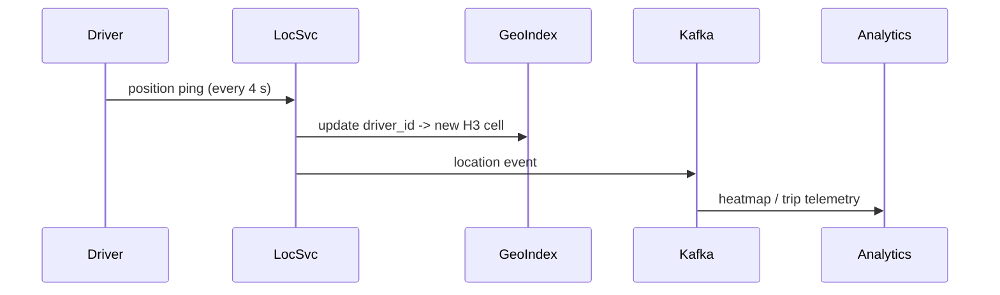
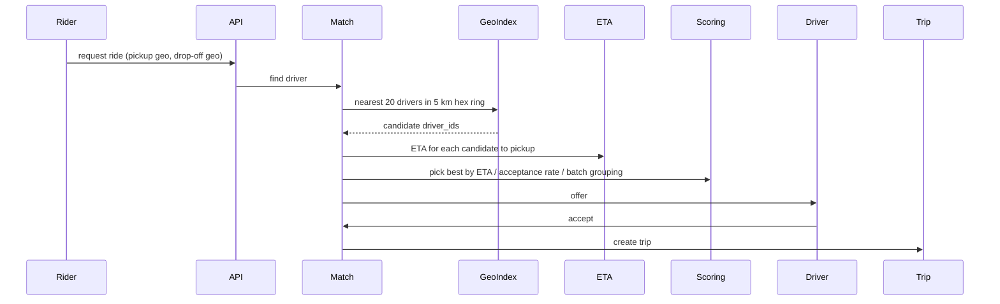

# Design Uber / Lyft

> **TL;DR** — Ride-sharing is a **real-time geo-spatial matching** problem. Every few seconds, every driver pings their location; every rider request must find the nearest few drivers in milliseconds. The geo index is the heart of the system — typically **geohash** or **H3** (Uber's open-source hex grid). The other hard parts are **pricing** (real-time surge based on supply/demand), **state machine for a trip** (requested → matched → en route → arrived → completed) reliably across mobile networks, and **payment settlement** at the end. Uber's H3 library deserves study; it's a public masterclass in geo indexing.

---

## 1. Requirements

### Functional
- Riders request a ride with pickup + drop-off locations.
- System matches them to a nearby available driver.
- Real-time location tracking during the trip.
- Fare calculation, payment processing.
- Surge pricing.
- Trip history, receipts.
- Ratings.

### Non-Functional
- Match latency p99 < 1 s.
- Location updates: 1–5 sec freshness.
- Availability: 99.99% (especially in metros).
- Scale: ~150 M MAU, ~30 M rides/day, ~5 M active drivers globally.

---

## 2. Back-of-the-Envelope

- 5 M drivers × 1 location ping every 4 sec = ~1.25 M location writes/sec.
- 30 M rides/day → ~350 rides/sec average, several thousand peak.
- Per match: query "nearest 10 available drivers" in a ~5 km radius — must return in tens of ms.

---

## 3. High-Level Architecture



The matching engine is the brain; the geo index is the bones.

---

## 4. The Geo Index

You can't `SELECT * FROM drivers WHERE distance(x, y) < 5km` at 1.25 M writes/sec. You need a spatial index.

### 4.1 Geohash
Encode (lat, lng) as a string like `9q8yyk8`. Nearby points share prefixes. Lookup = prefix search.

Limitations: rectangular cells, awkward at poles, neighbor lookups need 8 cell checks.

### 4.2 Quadtrees / R-trees
Recursive spatial subdivision. Powerful but harder to distribute.

### 4.3 H3 (Uber's hexagonal grid)
The world tiled into hexagons at multiple resolutions. Each cell has a 64-bit ID.
- Hexagons → uniform neighbor distances (6 neighbors equally far).
- 16 resolution levels — pick by problem (1 km cells for matching, 100 m cells for ETAs).
- Drivers register in their current H3 cell.

```
"give me drivers in this hex + 6 neighbors" = O(1) lookup of 7 sets
```

Backed by an in-memory store partitioned by H3 cell prefix. See [Geohashing & Quadtrees →](../19-advanced/geohashing-quadtrees.md).

---

## 5. Driver Location Pipeline



- Pings sent over persistent connection (HTTP/2 or proprietary protocol) to minimize per-message overhead.
- Updates land in an in-memory geo index sharded by region.
- Stale locations (driver offline > 30 s) are evicted via TTL.

---

## 6. The Matching Engine

When a rider requests:



Scoring isn't pure "nearest driver":
- Driver ETA to pickup (the dominant factor).
- Driver acceptance rate.
- Match grouping for shared rides (UberPool/Lyft Line).
- Reverse-positioning: keep drivers where future demand will be (predictive).

Match latency target: ~1 second to dispatch.

---

## 7. The Trip State Machine

Each ride is a tiny state machine:

```
REQUESTED → MATCHED → DRIVER_EN_ROUTE → DRIVER_ARRIVED →
TRIP_STARTED → IN_PROGRESS → COMPLETED → PAID
```

This is harder than it sounds at mobile-network reliability:
- **Idempotent transitions** — duplicate "I arrived" events must not break things ([idempotency →](../03-apis/idempotency.md)).
- **Timeouts** — driver doesn't accept in 15 s → reassign.
- **Recovery** — both apps may crash; trip state lives server-side, devices re-sync.
- Often implemented with an explicit state machine framework (Temporal, AWS Step Functions, or in-house).

---

## 8. ETA and Routing

ETA service answers "how long from A to B by car?"
- Builds on **road network graph** (OpenStreetMap derivative).
- Uses **contraction hierarchies** or A* for shortest path.
- Real-time traffic overlays (other drivers' speeds aggregated).
- Cached for common O→D pairs.

Uber rewrote their routing engine for this — the classic Dijkstra is too slow at scale.

---

## 9. Pricing and Surge

Base fare = pickup fee + per-mile + per-minute + dynamic surge multiplier.

Surge:
- Per geographic cell (often H3 hexes at ~1 km resolution).
- Computed from supply (idle drivers) vs demand (open requests) every ~60 sec.
- Multiplier shown to rider before they confirm.
- Fenced — surge in one hex can be ×1.5, neighboring ×1.0.

---

## 10. Payments

After trip completion:
- Authorize amount on rider's card (held since trip start).
- Capture final fare.
- Settle with driver (weekly payouts typical).
- Handle disputes, refunds, tips post-trip.

See [Payment System →](./payment-system.md).

---

## 11. Real-Time Tracking

Rider sees driver moving on the map. Driver sees rider's pickup pin.
- Driver location streamed via WebSocket / Server-Sent Events.
- Smoothed client-side (interpolate between pings; snap to road).
- Bidirectional during the trip until completion.

---

## 12. Storage

- **Trip records**: Cassandra / DynamoDB partitioned by `trip_id`. Hot recent + cold archive.
- **User profiles**: relational (Postgres).
- **Driver location**: in-memory store + persistent backup.
- **Heatmaps / analytics**: stream into a data lake.

Uber built **Schemaless** (MySQL-backed KV) and contributes heavily to Cassandra.

---

## 13. Multi-Region

Uber runs region-active services: a single city's matching engine lives in a regional cluster. Cross-region writes are rare — riders and drivers in city X are matched within city X's cluster.

This is **cell-based architecture** in practice — see [Cell-Based Architecture →](../11-reliability/cell-architecture.md). A failure in one city's cluster doesn't take down rides everywhere.

---

## 14. Common Mistakes

- **Storing live driver locations in Postgres** — write rate kills it. In-memory + Kafka.
- **Linear scan for nearest drivers** — needs a real geo index.
- **No explicit trip state machine** — leads to "stuck" trips, double charges.
- **Single global matching cluster** — failure radius too large.
- **Latency-blind matching** — must respond in seconds, not minutes.
- **No predictive positioning** — supply / demand mismatch grows; surge spikes.

---

## 15. Cheat Card

```
PURPOSE    Real-time geo-spatial driver/rider matching + trip orchestration.

CORE       H3 hex grid for geo index (Uber's open-source library)
           In-memory location store sharded by region
           Matching engine: nearest candidates × ETA × acceptance score
           Trip state machine (Temporal-style) for reliability
           Per-cell surge from real-time supply/demand

NUMBERS    5M drivers, 1.25M location writes/sec
           30M rides/day; match < 1 s

PITFALLS   SQL for locations, no state machine, linear nearest-neighbor,
           global matching cluster, no idempotency on trip events.

RULE       The geo index decides everything else.
           Pick it carefully; live with it forever.
```

---

## Resources

### Articles
- "H3: Uber's Hexagonal Hierarchical Spatial Index" — Uber Engineering
- "Real-Time ETAs at Uber" — Uber Engineering
- "Schemaless, Uber's distributed datastore" — Uber Engineering
- "Designing Schemaless, Uber Engineering's Trip Datastore"

### Documentation
- **H3 library** — <https://h3geo.org>
- **OSRM** routing — <http://project-osrm.org>

### Videos
- ByteByteGo: "Design Uber"
- "Architecting an Uber Marketplace" — Uber engineering talks

### Adjacent reading
- [Ride-Sharing Matchmaking Engine →](./ride-matching.md)
- [Geohashing & Quadtrees →](../19-advanced/geohashing-quadtrees.md)
- [Google Maps →](./google-maps.md)
- [Cell-Based Architecture →](../11-reliability/cell-architecture.md)
- [Payment System →](./payment-system.md)

---

*Previous:* [← Spotify](./spotify.md)  |  *Next:* [Airbnb / Booking.com →](./airbnb.md)
