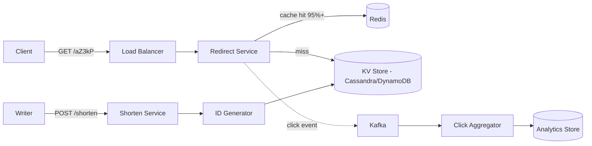
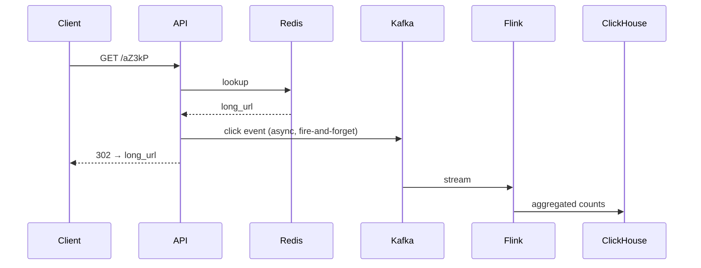

# Design a URL Shortener (TinyURL/Bitly)

> **TL;DR** — A URL shortener is a **read-heavy key-value lookup service** wearing the world's smallest API. The interesting parts aren't the redirect — they're **short-code generation** (avoiding collisions at billions of URLs), **cache hit rates** (you want >95%), **analytics ingestion** (every click is a write), and **expiration** at scale. Read:write is roughly **100:1** in production. Pick the right ID strategy upfront — base62 over a counter or hashed inputs — because rewriting it later means breaking every existing link.

---

## 1. Requirements

### Functional
- `POST /shorten` — given a long URL, return a short URL (e.g., `https://tiny.co/aZ3kP`).
- `GET /{code}` — redirect to the original URL with **HTTP 301/302**.
- Optional: custom aliases (`tiny.co/my-link`), expiration, click analytics.

### Non-Functional
- **Latency**: p99 redirect < 50 ms.
- **Availability**: 99.99% (redirect path is mission-critical).
- **Durability**: never lose a short → long mapping.
- **Scale**: Bitly does ~10 billion clicks/month; assume 100 M new URLs/day and 10 B redirects/day at peak design.

---

## 2. Back-of-the-Envelope

- 100 M writes/day → ~1,150 writes/sec average, 5–10× peak.
- 10 B reads/day → ~115 K reads/sec average, 500 K+ peak.
- **Read:write ratio ≈ 100:1** — design around reads.
- Storage: assume 500 bytes/record (URL + metadata). 100 M/day × 365 × 5 years ≈ 90 TB.
- A 7-character base62 code → 62⁷ ≈ 3.5 trillion possible codes. Plenty.

---

## 3. High-Level Architecture



The redirect path stays brutally short: LB → app → Redis → done. Analytics flow asynchronously.

---

## 4. The Short-Code Problem

This is the only hard part. Three approaches, in order of how seriously to take them:

### 4.1 Hash the URL (md5/sha256, truncate, base62)
```
code = base62(md5(url + salt))[:7]
```
**Pros**: deterministic — same URL gets same code (idempotent).
**Cons**: collisions are inevitable at truncation; retry on collision. Same URL from different users still maps to same code (sometimes you want that, sometimes not).

### 4.2 Counter + base62 (the canonical approach)
A globally unique 64-bit counter, encoded in base62 (`0-9A-Za-z`).
```
counter:  10_000_000_001
base62:   aZ3kPq
```
**Pros**: no collisions ever. Compact. Predictable.
**Cons**: sequential = enumerable (scrapers can iterate `aZ3kP0, aZ3kP1, ...`). Mitigate with a Feistel cipher or a random offset.

The counter itself is the bottleneck. Options:
- **Single Redis `INCR`** — easy, ~100 K/sec, single point of failure.
- **Batch-allocate ranges** to each app server (1,000 at a time) from a master counter (ZooKeeper, etcd, or a SQL sequence). Each server burns through its block locally; refills async.
- **Snowflake-style 64-bit IDs** — timestamp + machine + sequence (see [Distributed ID Generator →](./id-generator.md)).

### 4.3 Pre-generated pool
Generate a billion random 7-char codes ahead of time; pop one when you need it.
**Pros**: trivially fast, non-enumerable.
**Cons**: must generate and store the pool; refill operations.

**Verdict**: counter + base62 with batched allocation is what Bitly, TinyURL, and goo.gl all converged on. Add a Feistel cipher if you don't want enumerable codes.

---

## 5. Storage

```
SCHEMA (Cassandra / DynamoDB)
  PK: short_code  (string, 7 chars)
  long_url        (string)
  user_id         (string, nullable)
  created_at      (timestamp)
  expires_at      (timestamp, nullable)
  click_count     (counter, denormalized; truth lives in analytics)
```

Why KV / wide-column over Postgres? Because **the access pattern is 99% `SELECT * WHERE short_code = ?`** — pure key lookup. Cassandra/DynamoDB scale this trivially across regions. Postgres works fine up to a few hundred million rows; past that, you're paying for features you don't use.

For custom aliases, add a uniqueness check (`IF NOT EXISTS` insert).

---

## 6. The Cache

Redis in front of the KV store. The Pareto law applies hard here — a small percentage of links account for most clicks (viral content, branded redirects).

- **Strategy**: cache-aside, TTL 24 h, with `SETEX` on miss.
- **Hit rate target**: 95%+.
- **Hot-key protection**: if one code gets millions of hits/sec (something went viral), promote it to **per-host in-memory cache** and skip Redis entirely. See [Cache Pitfalls →](../05-caching/cache-pitfalls.md).

---

## 7. The Redirect — 301 vs 302

- **301 Moved Permanently** — browsers cache the redirect. Your server stops seeing clicks. Bad for analytics.
- **302 Found** — every click hits your server. Good for analytics, slightly worse on latency.

Bitly uses **301 with `Cache-Control: private, max-age=90`** as a compromise; most shorteners use 302.

Always echo `Cache-Control` headers explicitly. Default browser behavior on bare 301s will silently kill your click data.

---

## 8. Analytics — The Write Side

Every click is a write. At 500 K clicks/sec peak you cannot write each one synchronously to a DB.



- **Fire-and-forget to Kafka** in the redirect path. Never block the user.
- A Flink/Spark job aggregates per minute/hour/day.
- Counts land in a columnar store ([ClickHouse / Druid / Pinot →](../19-advanced/real-time-analytics.md)).
- Geolocation, referrer, user-agent enrichment happens in the pipeline, not in the redirect handler.

---

## 9. Expiration

Two options:
1. **TTL on the storage row** — DynamoDB and Cassandra both support row-level TTL natively. Simple. Lossy precision (eventually deleted, not immediately).
2. **Lazy expiration** — check `expires_at` at read time; return 404 if past. Periodic cleanup job sweeps stale rows.

Both are used; (1) is operationally simpler.

---

## 10. Custom Aliases

A second write path: user supplies `code`, you do conditional insert.
```sql
INSERT INTO urls (code, long_url, ...) IF NOT EXISTS
```
On collision: return 409. Reserve a profanity blocklist. Limit length.

---

## 11. Multi-Region

The redirect is the global hot path. Bitly and TinyURL run globally distributed read replicas:

- **DNS-based routing** ([GSLB →](../06-load-balancing/gslb.md)) sends users to the closest region.
- Each region has a full read cache + read replica of the KV store.
- Writes go to a primary region (URLs are write-once; eventual consistency on reads is acceptable).
- Counter generation must be globally unique — use Snowflake-style IDs with region in the high bits to avoid coordination.

---

## 12. Common Mistakes

- **Using `INCR` on a single Redis as your only counter** — single point of failure; latency under load.
- **Picking SHA-256 truncation without collision handling** — at billions of URLs, the birthday paradox bites.
- **Writing click events synchronously to a SQL DB** — falls over at 10× design load.
- **301 by default without thinking** — kills analytics silently.
- **Not rate-limiting `POST /shorten`** — spammers will mint millions of URLs to redirect to phishing pages. Rate-limit, scan with Google Safe Browsing, expire aggressively.
- **Treating shortener as a side project** — at scale it's a CDN-grade service; underestimate at your peril.

---

## 13. Cheat Card

```
PURPOSE    Map a short opaque code to a long URL, fast, forever.

CORE       Read:write ~100:1   →   design for reads
           Cache hit > 95% in Redis
           Counter + base62 = canonical short-code strategy
           Click events → Kafka → Flink → columnar analytics

API        POST /shorten { url } -> { code }
           GET  /{code}          -> 302 redirect

STORAGE    KV store (DynamoDB / Cassandra). 7-char base62 = 3.5 trillion codes.

PITFALLS   single-Redis counter, sync analytics writes,
           collisions on truncated hash, naive 301 caching.

RULE       The redirect path is a CDN, not a webapp.
           Everything else is async.
```

---

## Resources

### Articles
- "URL Shortener System Design" — High Scalability blog: <http://highscalability.com>
- "How Bitly Stores Data" — Bitly Engineering blog
- "Designing a URL Shortener" — Gaurav Sen / ByteByteGo

### Documentation
- **DynamoDB TTL** — <https://docs.aws.amazon.com/amazondynamodb/latest/developerguide/TTL.html>
- **Cassandra row TTL** — <https://cassandra.apache.org/doc/latest/cassandra/cql/dml.html#using-ttl>

### Videos
- ByteByteGo: "Design a URL Shortener"
- System Design Interview, Alex Xu Vol. 1, ch. 8

### Adjacent reading
- [Distributed ID Generator (Snowflake) →](./id-generator.md)
- [Consistent Hashing →](../04-databases/consistent-hashing.md)
- [Rate Limiting →](../03-apis/rate-limiting.md)
- [Cache Pitfalls →](../05-caching/cache-pitfalls.md)
- [Real-Time Analytics →](../19-advanced/real-time-analytics.md)

---

*Up:* [README ↑](../README.md)  |  *Next:* [Pastebin →](./pastebin.md)
