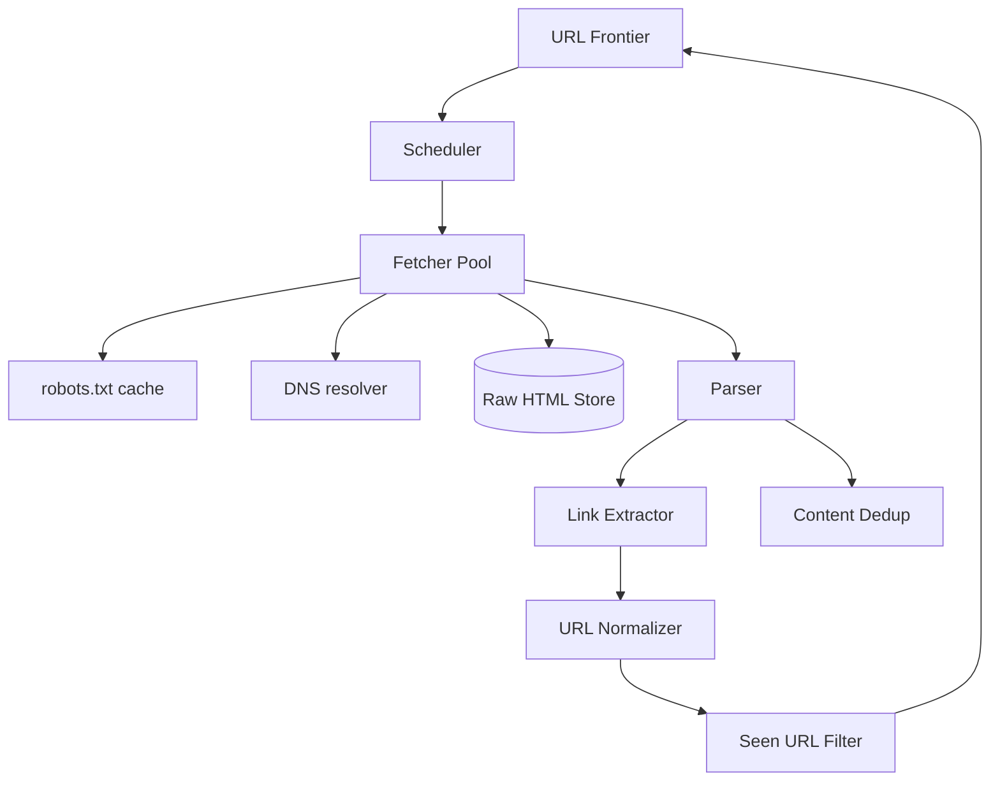
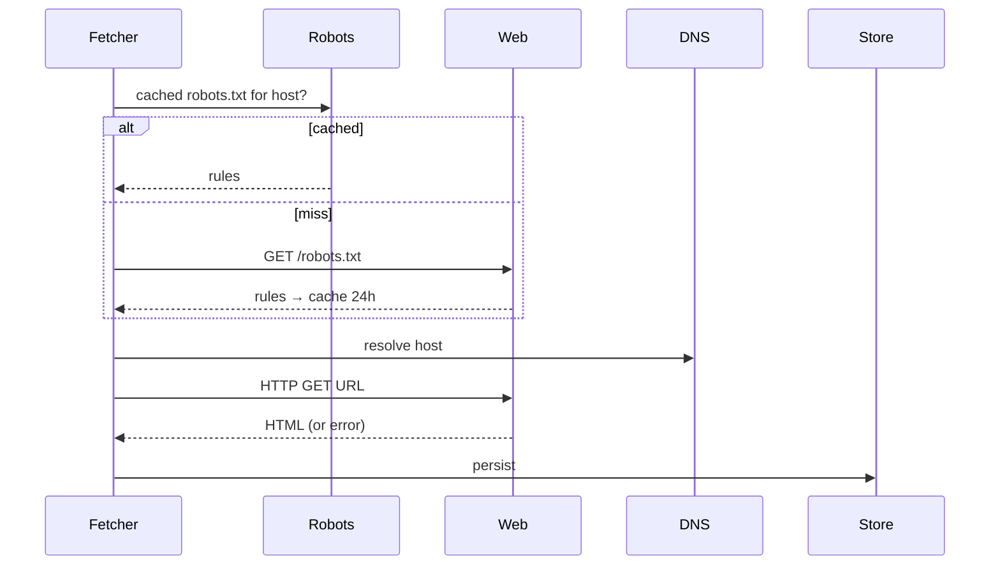

# Design a Web Crawler

> **TL;DR** — A crawler is a **priority queue of URLs being fetched, with politeness constraints**. The brutal fact: the web is hostile. You'll hit infinite-depth calendars, soft-404s, JavaScript-only pages, sitemap-less domains, rate-limit retaliators, and outright malware. The crawler architecture is well-understood (frontier, fetcher, parser, dedup, scheduler), but the operational realities — per-host throttling, robots.txt caching, DNS warm-up, content-hash dedup — are what make a real crawler not embarrass you. Heritrix, Apache Nutch, and Common Crawl are the open-source reference implementations.

---

## 1. Requirements

### Functional
- Fetch URLs and store HTML.
- Extract links from fetched pages; add to crawl queue.
- Respect robots.txt and crawl-delay directives.
- Avoid duplicates (URL and content).
- Schedule re-crawls based on update frequency.
- Handle different content types and encodings.

### Non-Functional
- Throughput: 10K+ pages/sec average for big crawlers.
- Politeness: don't hammer any single domain.
- Reliability: resume after crashes.
- Storage: scale to petabytes.

---

## 2. Back-of-the-Envelope

- 10 K pages/sec × 86 K sec/day = ~860 M pages/day.
- 100 B pages total (Google scale) / 10 K/sec = 116 days to crawl once.
- Avg page ~100 KB compressed → 86 PB raw HTML for full 100 B.

---

## 3. High-Level Architecture



The frontier is the brain. Fetchers are the workhorses.

---

## 4. The URL Frontier

Priority queue of URLs to crawl. Prioritized by:
- **PageRank estimate** (more important pages first).
- **Update frequency** (news sites crawled more often).
- **Politeness window** (don't fetch the same host too soon).

Implementation typically as **two-tier queue**:
- **Host queues**: one queue per host. Pop one URL at a time per host with crawl-delay between pops.
- **Domain priority queue**: orchestrates which host to pull from next.

This ensures politeness without sacrificing throughput across the web.

---

## 5. The Fetcher



Concerns:
- **Connection pooling** per host.
- **Timeouts** generous but bounded (10–30 s).
- **Compression** (Accept-Encoding: gzip).
- **User-Agent** identifies your crawler (legal + ethical).
- **HTTPS**.

Scaling: thousands of fetchers across many machines. Each is async I/O (one process can handle ~1K concurrent connections).

---

## 6. robots.txt

Per-domain rules file. Must:
- Fetch and cache.
- Respect `Disallow` rules.
- Respect `Crawl-delay`.
- Re-fetch periodically (24 h typical).

Don't skip this. Many sites will block your IP range if you ignore robots.txt; some will sue.

---

## 7. URL Normalization and Dedup

URLs are messy:
- `http://Example.com/` vs `http://example.com`
- `http://example.com/path` vs `http://example.com/path/`
- `http://example.com/?a=1&b=2` vs `http://example.com/?b=2&a=1`
- Session IDs in query strings.

Canonicalize before adding to frontier. Then dedup against a **seen-URL set**:
- **Bloom filter** (memory-efficient, probabilistic) — fast first check.
- **Persistent hash set** (e.g., RocksDB) — exact second check.

Hundreds of billions of URLs → bloom filter at 10 bits/URL × 100 B = 125 GB. Distributed.

See [Bloom Filters →](../08-distributed-systems/bloom-filters.md).

---

## 8. Content Dedup

Different URLs can serve the same content (mirrors, syndication). Hash the page content and dedup by hash before storing.

```
hash = sha256(normalized_content)
if hash in seen_content: skip
```

---

## 9. Spider Traps

The web is full of "infinite" subspaces:
- Calendar pages: `/2024/01/01`, `/2024/01/02`, ... forever.
- Session IDs in URLs creating "new" pages indefinitely.
- Faceted-search URLs (every filter combo is a new URL).

Mitigations:
- **Depth limits** per host.
- **Pattern detection**: pages that just link to themselves with different parameters.
- **Total page cap** per host.
- **Manual exclusion lists** for known traps.

---

## 10. Refresh Strategy

Once a page is crawled, when to re-crawl?
- **News sites**: hours.
- **Wikipedia**: daily.
- **Long-tail blogs**: weekly to monthly.
- **Static pages**: rarely.

Learn from history: pages that change often → crawl more often.

Implementation: each URL has a `next_crawl_at`. Scheduler picks ripe URLs from frontier.

---

## 11. Storage

Per-page record:
```
url            reversed: com.example/path
crawled_at
status         200, 404, ...
content_hash
content        compressed HTML
content_type
links          extracted out-links
```

Bigtable / HBase style — wide-column, sorted by reversed URL for locality.

Common Crawl publishes WARC files (Web ARChive format) as the standard for crawl dumps.

---

## 12. JavaScript-Rendered Pages

Modern web is JS-heavy. To crawl SPAs:
- Use a **headless browser** (Chromium via Puppeteer/Playwright).
- Wait for network idle / DOM ready.
- Extract from rendered DOM.

10–100× more expensive than HTTP fetch. Use selectively (only when needed).

---

## 13. Politeness — The Ethical Part

- One concurrent fetch per host (or whatever robots.txt says).
- Crawl-delay between requests.
- Honor `429 Too Many Requests` and back off.
- Identify your crawler in User-Agent.
- Provide a contact in User-Agent for webmasters.

A poorly-tuned crawler is a DDoS attack. Take it seriously.

---

## 14. Common Mistakes

- **Ignoring robots.txt** — legally and ethically wrong; gets you IP-banned.
- **No URL normalization** — frontier explodes with duplicates.
- **No content dedup** — store identical pages across mirrors.
- **No bloom filter** — `seen` set blows out memory.
- **Single-host blasting** — kills the host, blocks your IP.
- **No backoff on errors** — keeps slamming a broken host.
- **No depth limits** — spider traps consume the queue forever.

---

## 15. Cheat Card

```
PURPOSE    Discover and download web pages, politely and at scale.

CORE       URL frontier with per-host queues + priority by domain
           Fetchers in async pools; cached robots.txt + DNS
           Bloom filter + persistent set for URL/content dedup
           Two-tier seen-URL: bloom (fast) + RocksDB (exact)
           Headless browser for JS-rendered pages (selectively)

POLITENESS One concurrent fetch per host, respect crawl-delay,
           identify in User-Agent

PITFALLS   ignoring robots, no normalization, no dedup,
           no depth caps (spider traps), no backoff.

RULE       The frontier is the brain.
           Politeness is the law.
```

---

## Resources

### Articles
- "Mercator: A Scalable, Extensible Web Crawler" — Heydon & Najork
- "Common Crawl" — large public crawl corpus, <https://commoncrawl.org>
- "Heritrix" — Internet Archive's crawler

### Documentation
- **Apache Nutch** — <https://nutch.apache.org>
- **Scrapy** — Python framework
- **Puppeteer / Playwright** — headless browser tools

### Books
- *Introduction to Information Retrieval* — Manning et al., ch. 20

### Videos
- ByteByteGo: "Design a Web Crawler"

### Adjacent reading
- [Google Search →](./search-engine.md)
- [Bloom Filters →](../08-distributed-systems/bloom-filters.md)
- [Job Scheduler →](./job-scheduler.md)
- [DNS →](../02-networking/dns.md)

---

*Previous:* [← Distributed Counter](./distributed-counter.md)  |  *Next:* [Typeahead / Autocomplete →](./typeahead.md)
