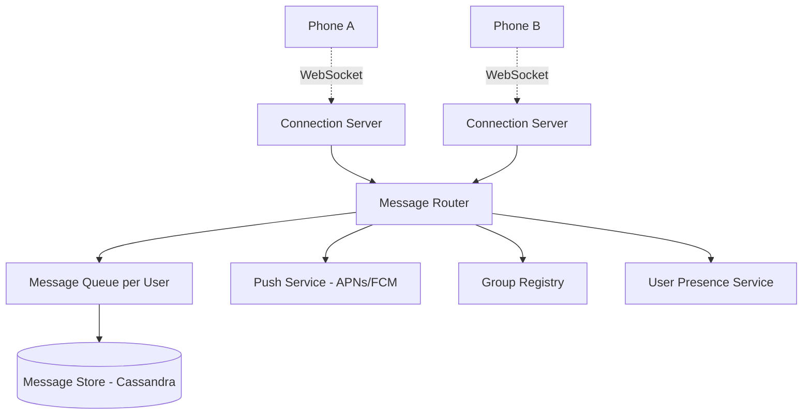
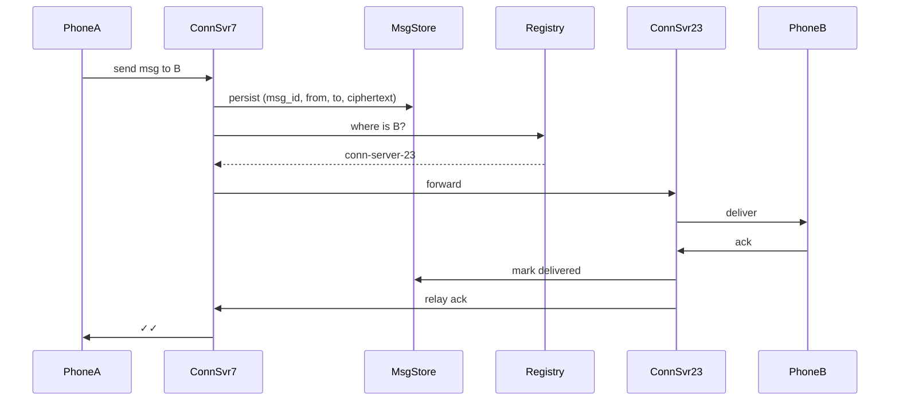

# Design WhatsApp / Messenger

> **TL;DR** — A messenger is a **persistent connection problem** more than a database problem. The hard parts are (1) keeping a connection open for every online user — billions of TCP/WebSocket sockets — (2) routing each message to the right phone in <100 ms globally, and (3) **end-to-end encryption** that survives multi-device and group chats. The famously Erlang-powered WhatsApp ran with ~1 million connections per server. Messages are tiny (~100 bytes), but the metadata problem (group membership, delivery receipts, read receipts) dwarfs the message content itself.

---

## 1. Requirements

### Functional
- 1:1 messaging (text, image, video, voice, file).
- Group chats (up to ~1,000 members).
- Online/last-seen status.
- Delivery receipts (sent ✓ / delivered ✓✓ / read ✓✓ blue).
- Typing indicators.
- End-to-end encryption (Signal protocol).
- Voice/video calls (separate WebRTC subsystem).

### Non-Functional
- Latency: message delivery p99 < 500 ms globally.
- Availability: 99.99%.
- Durability: never lose a sent message before delivery.
- Scale: ~2.5 B users, ~100 B messages/day, ~1 B concurrent online.

---

## 2. Back-of-the-Envelope

- 100 B messages/day → ~1.2 M msgs/sec average, ~5 M peak.
- Average message ~100 bytes encrypted → ~10 TB/day raw.
- 1 B concurrent → with 1 M connections/server, need ~1,000 connection servers.
- Group chats are the volume multiplier — a single send to a 500-person group = 500 delivery events.

---

## 3. High-Level Architecture



Two operational halves: **online delivery** (route message through WebSocket) and **offline delivery** (queue + push notification).

---

## 4. The Connection Layer

This is the part that's different from everything else.

- Each online client holds a persistent **WebSocket** (or proprietary protocol) to a Connection Server.
- A connection server holds **~1 M concurrent connections** with proper OS tuning (file descriptors, ephemeral ports, epoll).
- WhatsApp famously used Erlang/BEAM for this — green threads make 1 M idle sockets cheap.
- Connection servers register themselves in a lookup service: `user_id → connection_server_id`.

```
User A is on conn-server-7
User B is on conn-server-23
A → conn-server-7 → router → conn-server-23 → B
```

---

## 5. Routing a Message



If B is offline:
- Message stays in B's offline queue.
- Push notification (APNs/FCM) wakes B's phone.
- When B reconnects, queue drains to B.
- Once delivered, message is deleted from server (WhatsApp keeps no permanent server-side copy — see encryption section).

---

## 6. The Message Store

Messages are stored only **until delivery** in WhatsApp's model. Some platforms (Messenger) keep history server-side; their store is larger.

Schema (Cassandra):
```
PK:    user_id
CK:    msg_id (Snowflake)
       sender_id
       ciphertext
       delivered_at
       read_at
```

Partitioned by recipient `user_id`. Per-user "inbox" partition. Each device retrieves its messages, then they're deleted (WhatsApp) or kept (Messenger).

---

## 7. End-to-End Encryption (E2EE)

WhatsApp uses the **Signal Protocol** by Open Whisper Systems. Sketch:

- Each user has a long-term identity key + rotating session keys (Double Ratchet).
- Server never has plaintext.
- Each message uses a new symmetric key, derived from a ratchet algorithm.
- New devices fetch pre-keys to start a session.

This makes server-side features harder:
- **No server-side search** of message content.
- **Backups** are tricky — WhatsApp encrypts backups with a user-set key.
- **Group chats** require pairwise sessions OR a group key (Signal uses "Sender Keys").

---

## 8. Group Chats

Group of N members = N pairwise messages? With Sender Keys:
- Sender encrypts message once with a sender key.
- Each member has previously received the sender key (encrypted to their pairwise session).
- One ciphertext is broadcast to all N members through the server.

Server has a Group Registry:
```
group_id → [user_a, user_b, ...]
```

Fan-out happens at the message routing layer: read group membership, push to each member's inbox/queue.

Membership changes (add/remove) require key rotation among remaining members.

---

## 9. Presence and Typing Indicators

- **Online status**: when WebSocket connects, mark online in a presence service (Redis with short TTL). Disconnect → offline.
- **Last seen**: write last-seen timestamp on disconnect.
- **Typing indicators**: ephemeral pub/sub events, not stored. Sent over the same WebSocket.

Presence is expensive at scale (every connection event mutates state). Cap by sampling or short polling for last-seen updates.

---

## 10. Delivery and Read Receipts

Three states: sent, delivered, read.
- **Sent**: server accepted from sender.
- **Delivered**: recipient device acked over their connection.
- **Read**: recipient client signaled read action.

Each state is an ack event, routed back through the same pipes. Read receipts can be disabled by user — server just suppresses the event.

---

## 11. Voice and Video Calls

Separate stack — typically WebRTC.
- **Signaling** goes through the same WebSocket connection (call invite, ICE candidates).
- **Media** is peer-to-peer when possible; via TURN relay if behind symmetric NATs.
- See [WebRTC →](../19-advanced/webrtc.md) and [Zoom →](./zoom.md).

---

## 12. Multi-Device

Originally WhatsApp was strictly one phone per account. Multi-device complicates encryption: each device is a separate session endpoint.

- Each device has its own keys; group sender keys must be shared with each.
- Message delivered to all devices of the recipient.
- New device added → fetch missed messages from companion devices, then sync new ones.

---

## 13. Push Notifications

For offline recipients, fire **APNs** (iOS) or **FCM** (Android). Push payload contains just "you have a message" — actual content is fetched when the app wakes (preserves encryption).

This service must handle ~10s of millions of push events/sec on global peaks.

---

## 14. Multi-Region

- Connection servers in every region.
- Cross-region message routing when sender and recipient are in different regions.
- User → home-region affinity for inbox storage.
- Cross-region replication with eventual consistency for inbox (rarely matters because messages get delivered and removed).

---

## 15. Common Mistakes

- **Treating it as a generic chat app** — connection management is the actual hard problem.
- **HTTP polling instead of WebSocket** — won't scale and burns battery.
- **Storing message history forever** — WhatsApp's deletion-on-delivery design is what makes its storage manageable. Choose your retention model carefully.
- **Ignoring offline queue size limits** — a user offline for a year would accumulate gigabytes. Cap inbox; show "messages truncated" or rely on phone-side history.
- **Group fan-out at send time** — fine for 500 people, painful for 100K-member channels. Telegram-style channels need broadcast servers.
- **Re-encrypting on every key rotation** — Signal's ratchet is incremental for a reason.

---

## 16. Cheat Card

```
PURPOSE    Real-time global 1:1 and group messaging.

CORE       Persistent WebSocket connections, ~1M/server
           Two paths: online routing + offline queue + push
           Snowflake message IDs for ordering
           Signal protocol for E2EE; Sender Keys for groups
           Messages deleted after delivery (WhatsApp model)

NUMBERS    100B msgs/day, ~5M msgs/sec peak
           Average message ~100 bytes encrypted
           p99 delivery < 500 ms

PITFALLS   HTTP polling, syncing entire group on every send,
           keeping plaintext server-side, naive presence storms.

RULE       Connection servers do the heavy lifting.
           The DB is the holding pen for offline users.
```

---

## Resources

### Articles
- "The WhatsApp Architecture Facebook Bought For $19 Billion" — High Scalability
- "Signal Protocol Documentation" — <https://signal.org/docs/>
- "Scaling WhatsApp" — Rick Reed's talks (Erlang Factory)

### Documentation
- **Signal Protocol** — <https://signal.org/docs/specifications/doubleratchet/>
- **APNs** — Apple Push Notification Service
- **WebSockets RFC 6455**

### Videos
- Rick Reed: "That's 'Billion' with a 'B': Scaling to the Next Level at WhatsApp"
- ByteByteGo: "Design WhatsApp"

### Adjacent reading
- [Slack / Discord →](./slack.md)
- [WebSockets →](../02-networking/websockets.md)
- [Zoom →](./zoom.md)
- [Notification System →](./notification-system.md)
- [WebRTC →](../19-advanced/webrtc.md)

---

*Previous:* [← Facebook News Feed](./news-feed.md)  |  *Next:* [Slack / Discord →](./slack.md)
