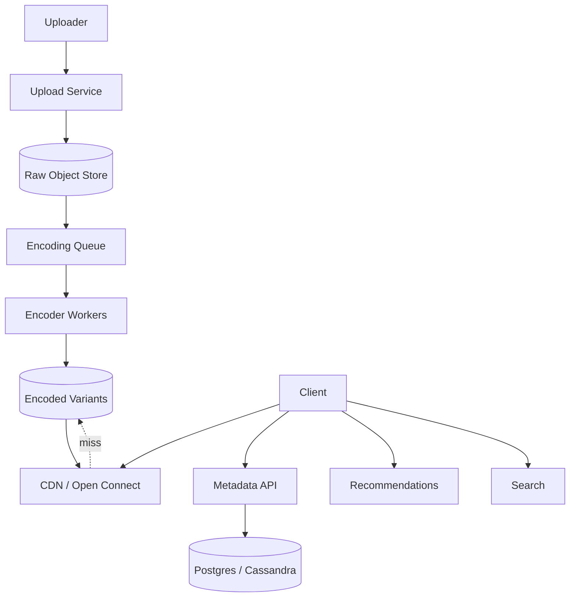
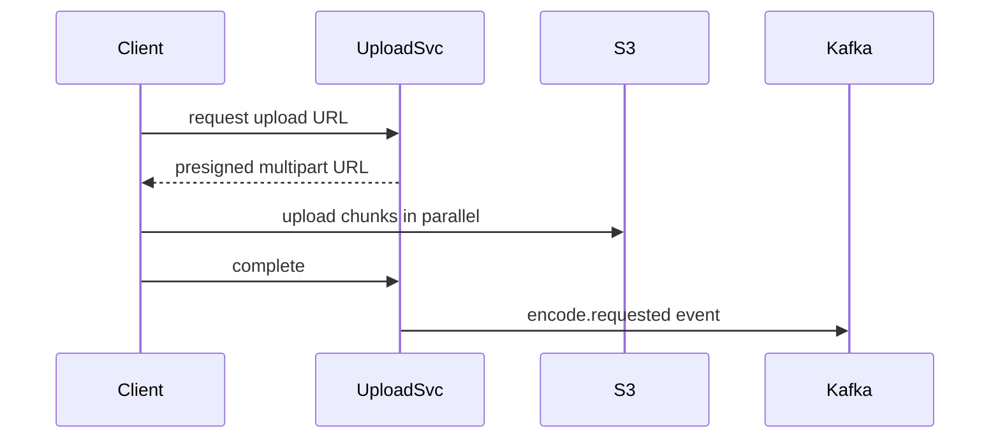

# Design YouTube / Netflix (Video Streaming)

> **TL;DR** — Video streaming is **two systems wearing a single skin**: an **upload + encoding pipeline** (where videos are transcoded into a dozen formats and bitrates) and a **delivery pipeline** (where bytes are pushed through a CDN to the player). YouTube and Netflix differ in the front of the funnel — YouTube ingests user uploads at massive scale, Netflix has a curated catalog — but converge at the back: **adaptive bitrate streaming (HLS/DASH)** served from globally distributed edge caches. Netflix's **Open Connect** appliances live inside ISPs. Everything else (search, recommendations, metadata) is a normal web app.

---

## 1. Requirements

### Functional
- Upload video (YouTube) / ingest from studios (Netflix).
- Transcode into multiple resolutions and bitrates.
- Stream with adaptive bitrate so quality matches client bandwidth.
- Search and discovery.
- Recommendations / personalization.
- Comments, likes, watch history.

### Non-Functional
- Streaming startup time p99 < 2 s.
- Rebuffer rate < 0.5%.
- Availability: 99.99%.
- Scale: YouTube ~500 hours uploaded/min; Netflix peaks at ~30% of global internet traffic at prime time.

---

## 2. Back-of-the-Envelope

- 500 hr/min × 1 GB/hr = ~30 TB/min of raw uploads (YouTube).
- After multi-bitrate transcoding: 5×–10× original storage.
- Watch traffic: Netflix ~250 Tbps at peaks globally.
- A single 4K stream: ~15 Mbps; HD ~5 Mbps; SD ~1.5 Mbps.

---

## 3. High-Level Architecture



Two halves: write-heavy ingestion + transcoding, read-heavy delivery + CDN.

---

## 4. Upload and Ingest



- **Chunked, resumable upload** — videos are large; partial failures are normal. Use the `tus` protocol or S3 multipart.
- Client writes to the storage layer directly via presigned URLs. App servers don't proxy bytes.
- A reference to the raw upload + metadata is enqueued for processing.

---

## 5. The Encoding Pipeline

Each raw video is transcoded into:
- Multiple **resolutions**: 360p, 480p, 720p, 1080p, 1440p, 2160p.
- Multiple **bitrates** within each resolution.
- Multiple **codecs**: H.264 (universal), VP9, AV1 (modern, efficient).
- Multiple **packaging**: HLS (Apple), DASH (Google), CMAF (unified).

Each variant is broken into **segments** (~2–6 seconds each) and ABR manifests are produced.

```
video_xyz/
  master.m3u8                  ← HLS master
  master.mpd                   ← DASH manifest
  v1_360p/segment_001.ts
  v1_360p/segment_002.ts
  ...
  v6_2160p_av1/seg_001.mp4
  ...
```

Encoding is brutally CPU/GPU intensive. Massive worker farms; jobs prioritized (popular content first). YouTube uses custom hardware (VCU — Video Coding Unit). Netflix uses cloud GPUs + per-title encoding (each video gets a custom bitrate ladder based on its content complexity).

---

## 6. Adaptive Bitrate Streaming (ABR)

The player monitors network conditions and switches segments dynamically:

```
buffer fills slowly → switch to lower bitrate
buffer fills fast → try higher bitrate
```

Standards:
- **HLS** (HTTP Live Streaming) — Apple, segment-based, m3u8 manifests.
- **DASH** (Dynamic Adaptive Streaming over HTTP) — open standard, mpd manifests.
- **CMAF** — common format used by both.

Player downloads:
1. Master playlist → list of bitrate variants.
2. Variant playlist → list of segments.
3. Segments via HTTP GET.

Every segment is just an HTTP request to the CDN.

---

## 7. The CDN

This is the heart of delivery.

- **Netflix Open Connect** — Netflix puts physical appliances inside ISP data centers, preloaded with the catalog. ISPs save peering costs; Netflix saves transit costs.
- **YouTube** uses Google's global edge network.
- **Third-party CDNs**: Akamai, Fastly, Cloudflare, CloudFront for general use.

Cache strategy:
- Long TTLs on segments (they're immutable; URLs encode version).
- Pre-positioning: push hot content (new releases) to edges before peak hours.
- Cache key = segment URL.
- Hit rate > 95% at edge.

---

## 8. Metadata and Catalog

- **Videos table**: id, title, description, uploader, duration, status, codec list, etc.
- **Users table**.
- **Subscriptions / Channels** (YouTube).
- **Watch history** per user.
- **Comments** (YouTube — high volume; threaded).
- **Likes / Dislikes** — counters.

Storage choice: Postgres or MySQL for OLTP; Cassandra for high-volume time-series like watch events.

---

## 9. Recommendations

The hidden moat.

YouTube: deep neural network ranking, candidate generation from collaborative filtering + content-based signals. Inputs: watch history, channel subscriptions, video embeddings, contextual features. See [Recommendation System →](./recommendation-system.md).

Netflix: row-based home page personalization — each row is a different recommender (because you liked X, top trending now, action movies for you).

---

## 10. Search

YouTube search:
- Inverted index over title, description, transcript, tags.
- Re-ranked by ML for relevance + watch likelihood.
- ~1 B queries/day.

Transcripts come from automatic speech recognition over the video.

---

## 11. Live Streaming

Different pipeline:
- Live encoding ingest (RTMP/SRT push to ingest server).
- Real-time transcoding into HLS/DASH variants.
- Edge distribution with low-latency HLS (LL-HLS) or WebRTC.
- See [Twitch →](./twitch.md).

---

## 12. DRM (Netflix)

User-generated content is mostly unprotected; premium catalog uses DRM.
- **Widevine** (Google), **PlayReady** (Microsoft), **FairPlay** (Apple).
- License servers issue per-session keys.
- Content is encrypted at rest; player decrypts segments using keys from license server.

---

## 13. Watch History and Resume

Per-user watch state:
- Current position (seconds) per video.
- Updated every ~10 s during playback (batched writes).
- Stored in Cassandra/DynamoDB; key = `(user_id, video_id)`.
- Used for "Continue Watching" rows.

---

## 14. Common Mistakes

- **One bitrate for everyone** — kills mobile users; wastes bandwidth on fiber users. Always ABR.
- **Encoding synchronously in the upload path** — uploads should return immediately; encoding is async.
- **No CDN** — origin servers cannot serve video at scale. Period.
- **Long TTLs without versioned URLs** — invalidation nightmare when re-encoding.
- **Treating recommendations as a feature** — for YouTube it's > 70% of watch time.
- **Storing watch events in OLTP DB** — 4 B/day of watch events kills relational. Use Cassandra/Kafka pipeline.
- **Ignoring per-title encoding** — naive ladders waste 30–50% bandwidth on simple content.

---

## 15. Cheat Card

```
PURPOSE    Global video upload and streaming at scale.

CORE       Chunked direct-to-storage upload (S3 / GCS)
           Async transcoder farm → 6+ resolutions × multi-bitrate × multi-codec
           ABR streaming (HLS / DASH) with ~2–6 sec segments
           CDN-first delivery; edge appliances inside ISPs (Netflix)
           Per-title encoding ladders for efficiency

NUMBERS    YouTube: 500 hr/min upload, 1B hr/day watched
           Netflix: ~250 Tbps peak, ~30% of global internet

PITFALLS   no ABR, sync transcode, no CDN,
           naive bitrate ladders, OLTP for watch events.

RULE       Encoding is async. Streaming is a CDN problem.
           Everything else is a normal web app.
```

---

## Resources

### Articles
- "Netflix's Open Connect" — Netflix Tech Blog
- "Per-Title Encoding" — Netflix Tech Blog
- "How YouTube Encodes Videos at Scale" — Google papers on VCU/Argos
- "Inside Netflix's Recommendation System" — Netflix research

### Documentation
- **HLS** — <https://developer.apple.com/streaming/>
- **DASH** — <https://dashif.org>
- **Widevine** — Google DRM

### Videos
- ByteByteGo: "Design Netflix" / "Design YouTube"
- Netflix Tech Talks on Open Connect

### Tools
- FFmpeg, GStreamer
- Shaka Packager
- Bento4 (MP4 tools)

### Adjacent reading
- [Spotify →](./spotify.md)
- [Twitch →](./twitch.md)
- [CDN →](../05-caching/cdn.md)
- [Recommendation System →](./recommendation-system.md)
- [Object Storage →](../09-storage/object-storage.md)

---

*Previous:* [← Slack / Discord](./slack.md)  |  *Next:* [Spotify →](./spotify.md)
