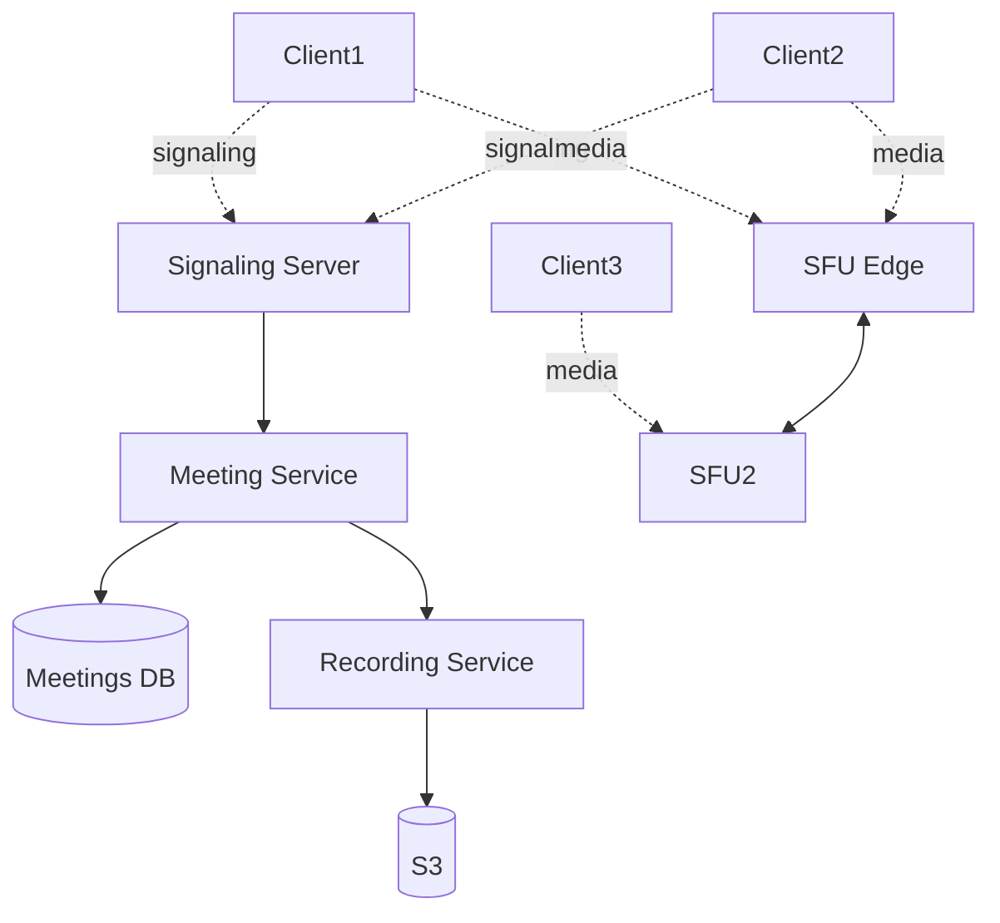

# Design Zoom / Video Conferencing

> **TL;DR** — Video conferencing is **a media routing problem with a signaling layer on top**. The hard architectural decision is **how media flows**: peer-to-peer (P2P) for 1:1, **MCU** (mixes streams server-side, sends one combined stream — expensive), or **SFU** (Selective Forwarding Unit — forwards each participant's stream to others without mixing — what Zoom and most modern platforms use). SFUs scale well and let clients decide which streams to render. The signaling (who's in the call, who shares screen, etc.) is normal API + WebSocket. **WebRTC** is the protocol stack underneath everything.

---

## 1. Requirements

### Functional
- 1:1 and group video calls (up to ~1000 participants).
- Audio, video, screen share, chat.
- Recording.
- Breakout rooms.
- Background blur / replacement.
- Call invites / scheduling.

### Non-Functional
- Audio latency p99 < 150 ms (humans notice anything above this).
- Video frame loss < 1%.
- Availability: 99.99%.
- Scale: ~300 M daily participants at COVID peak; ~30 K servers globally.

---

## 2. Back-of-the-Envelope

- Avg meeting: 10 participants × 30 min × ~2 Mbps = ~36 GB media per meeting.
- 300 M participant-meetings/day × N streams = exabytes of media transit per day.
- Most meetings are < 5 people; tail of large webinars goes to 10K+.

---

## 3. High-Level Architecture



Two distinct planes: **signaling** (control) and **media** (data).

---

## 4. Signaling

Before any media flows:
- Meeting created; meeting ID issued.
- Participants authenticate, join.
- Negotiation: ICE candidates exchanged, codec preferences, capabilities.

Implemented as a regular API + WebSocket. Standard backend: load-balanced servers, Redis for ephemeral state, DB for persistent meeting metadata.

---

## 5. Media Routing — The Big Decision

### 5.1 P2P
For 1:1 calls. Direct WebRTC connection between two peers. Works when both have good NATs / public IPs; falls back to TURN relay otherwise.

### 5.2 MCU (Multipoint Control Unit)
Server combines all participants' video into one output stream per recipient. Expensive (transcoding every meeting) but bandwidth-efficient for participants.

### 5.3 SFU (Selective Forwarding Unit)
Server receives each participant's stream and forwards (doesn't transcode) to others. Each participant uploads once, downloads N-1 streams (subject to simulcast — multiple bitrate variants).

**SFU is the modern standard** because:
- CPU-cheap on server (no transcoding).
- Clients choose which streams and which resolutions to render.
- Bandwidth still scales with participants but is manageable.

Zoom uses SFU. Google Meet uses SFU. Microsoft Teams uses SFU.

---

## 6. Simulcast and Adaptive Quality

Each sender produces 2–3 streams at different bitrates (e.g., 180p, 360p, 720p) — simulcast.

SFU forwards the appropriate stream per recipient:
- Recipient on slow Wi-Fi → 180p.
- Recipient with full bandwidth → 720p.
- Recipient with current speaker in gallery view → high quality for speaker, low for others.

Dynamic switching: as network conditions change, SFU swaps to a different simulcast layer.

---

## 7. ICE, STUN, TURN

Establishing the media connection:
- **ICE** (Interactive Connectivity Establishment) — protocol for finding the best connection path.
- **STUN** — server that helps a client discover its public IP (NAT traversal).
- **TURN** — relay server used when direct paths fail (corporate firewalls, symmetric NATs).

About 10–20% of connections require TURN relays. TURN servers are an operational cost; they carry the media bytes.

---

## 8. Codecs

- **Audio**: Opus (modern; royalty-free; adaptive 8–510 kbps).
- **Video**: H.264 (universal), VP9, AV1 (newer).
- Codec negotiation happens in signaling phase.

Bandwidth: ~50 kbps audio per stream, ~1–4 Mbps video per HD stream.

---

## 9. Recording

For meetings with recording enabled:
- SFU forwards copy to a recording bot.
- Recording bot mixes / lays out streams into a single video.
- Upload to object storage; transcode for playback.

For "local recording" — handled on the participant's machine.

---

## 10. Breakout Rooms

Sub-meetings within a meeting. Conceptually:
- Each breakout has its own SFU "room."
- Participants moved between rooms by control plane.
- Host can broadcast back to main from breakouts.

---

## 11. Multi-Region

Critical for low latency. Participants connect to nearest SFU edge (Anycast or DNS-based routing).

Cross-region meetings (US + EU participants) require SFU-to-SFU forwarding:
- Each participant connects locally.
- SFUs bridge across regions.
- One extra hop, but latency-optimized backbone.

---

## 12. Scale and Cost Engineering

- Single SFU server: ~100–500 concurrent streams (depends on hardware).
- Large meetings sharded across SFUs that gossip media.
- For webinars (1 speaker, 10K viewers): use **broadcast / CDN-like distribution**, not SFU. Pre-transcoded HLS often used.

---

## 13. End-to-End Encryption

Standard WebRTC uses encryption hop-by-hop (TLS to server). E2EE requires the SFU not to see plaintext — newer Zoom modes use Insertable Streams API to encrypt at the client before SFU.

E2EE in conferences is harder than 1:1 — key management with N participants is non-trivial.

---

## 14. Common Mistakes

- **MCU for large meetings** — burns CPU at scale; SFU is the right answer.
- **No simulcast** — slow clients ruin meetings for everyone.
- **One global SFU cluster** — cross-region latency kills.
- **TURN under-provisioned** — meetings fail for NAT-blocked users.
- **Recording in the same server as live meeting** — disk I/O contention. Separate bots.
- **Treating signaling and media identically** — they have different SLAs and scaling profiles.

---

## 15. Cheat Card

```
PURPOSE    Multi-party real-time audio + video + screen share.

CORE       Signaling (WebSocket) + Media (SFU) — two planes
           SFU forwards (no transcode); simulcast for adaptive quality
           ICE/STUN/TURN for NAT traversal
           Opus audio (~50 kbps), VP9/H.264 video (~1–4 Mbps HD)
           Regional SFU edges; cross-region SFU bridging

NUMBERS    Audio latency target < 150 ms p99
           SFU server: 100–500 concurrent streams

PITFALLS   MCU at scale, no simulcast, single-region SFU,
           TURN under-provisioned, recording on live SFU.

RULE       Server forwards, doesn't mix.
           Clients adapt to what they can render.
```

---

## Resources

### Articles
- "Zoom's architectural overview" — Zoom Engineering / press materials
- "How WebRTC Works" — Mozilla Developer Network
- "SFU vs MCU vs P2P" — webrtcHacks blog

### Documentation
- **WebRTC** — <https://webrtc.org>
- **RFC 8825 (WebRTC)** + related ICE / STUN / TURN RFCs
- **Mediasoup**, **Janus**, **LiveKit** — open-source SFUs

### Books
- *High Performance Browser Networking* — Ilya Grigorik (WebRTC chapter)

### Videos
- ByteByteGo: "Design Zoom"
- WebRTC tutorials on YouTube

### Adjacent reading
- [WebRTC →](../19-advanced/webrtc.md)
- [WhatsApp →](./whatsapp.md)
- [Twitch →](./twitch.md)
- [Multiplayer Game Backend →](./multiplayer-game.md)

---

*Previous:* [← Google Docs](./google-docs.md)  |  *Next:* [Notification System →](./notification-system.md)
